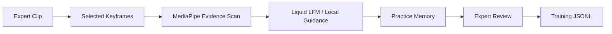
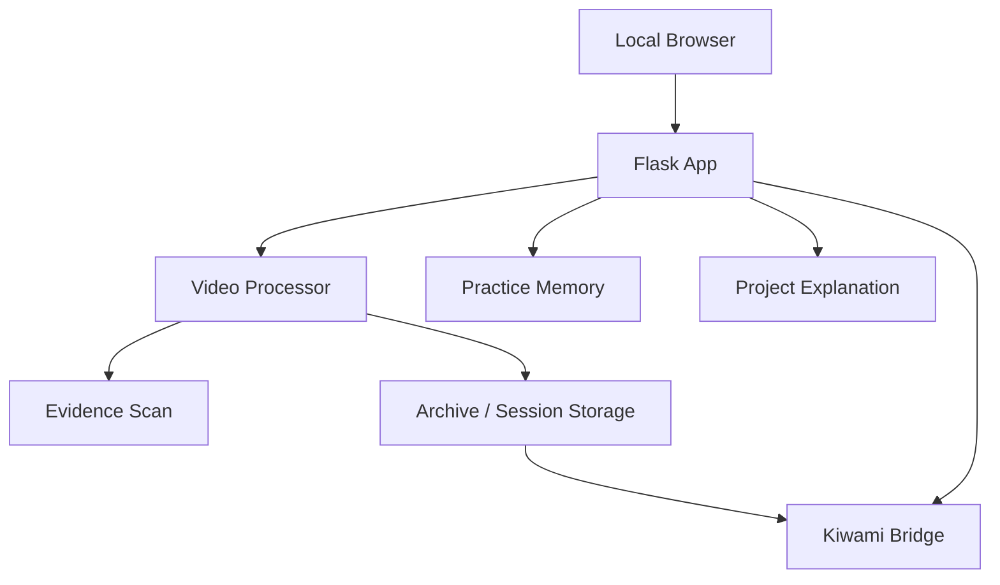
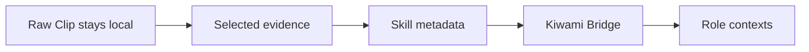

# Kiwami Capture

Local-first LFM application for preserving hands-on skill as Practice Memory.

Kiwami Capture turns expert demonstration clips into evidence-aware guidance using selected keyframes, MediaPipe Evidence Scan, local Liquid LFM guidance, expert review, and Training JSONL export.

Kiwami Capture preserves skill. Kiwami Bridge helps that skill find where it is needed next.

## KIWAMI BRIDGE

Kiwami Bridge connects preserved skill to the places where it can be needed next.

Rare hands-on expertise is often difficult to evaluate through a normal resume or job profile, especially when the value lives in motion, timing, judgment, tool handling, and field experience. Kiwami Bridge uses skill metadata from Kiwami Capture to make this hidden expertise easier to understand and connect with future learning, succession, job matching, and specialized work contexts.

It does not expose identity, faces, private video, or confidential information. It focuses on the skill itself: what was preserved, what it can teach, and where it may create value next.

## What Kiwami Means

“Kiwami” means mastery, refinement, or the pursuit of the highest level of craft. In this project, it represents the point where expert skill becomes difficult to write down, but still possible to observe, preserve, and pass forward.

## Problem

Many hands-on skills are difficult to write down, evaluate, and pass on. In craft, manufacturing, energy, data centers, piping, electrical transmission, pipe fitting, maintenance, inspection, and other specialized field work, expert knowledge often lives in motion, timing, judgment, and experience. As skilled workers age and specialized trades decline, this knowledge can disappear before the next generation can learn it.

## Solution

Kiwami Capture converts expert demonstration clips into structured Practice Memory. It helps successors understand what to notice, how to practice, and why expert motion matters. Kiwami Bridge then turns preserved skills into metadata that can connect them to learning, succession, job matching, and future industries without exposing private identity or confidential video.

## Business

Kiwami Capture can serve craft studios, schools, manufacturers, maintenance teams, infrastructure operators, energy facilities, and organizations that depend on rare technical roles such as pipe fitters, electrical technicians, field inspectors, machine installers, and specialized maintenance workers. It can start as local-first skill capture software and grow into training, skill archive management, and specialized skill-matching infrastructure for industries that depend on hard-to-replace human expertise.

## Challenge Theme Fit

This project fits the Liquid AI Challenge theme and Track 1: LFM Application Track because LFMs are the critical unlock for local, privacy-preserving skill capture.

Why LFMs matter here:

- many craft sites, factories, and field environments cannot rely on cloud-first workflows
- raw clips may contain private, unpublished, culturally sensitive, or site-specific knowledge
- workshops, factories, and field sites need efficient local inference
- the workflow is not generic summarization; it is evidence-aware Practice Memory generation

## Track 1 User Workflow

1. Upload expert clip
2. Extract selected keyframes
3. Generate MediaPipe Evidence Scan
4. Produce frame-based observations
5. Generate Practice Memory
6. Show Project Explanation
7. Allow Expert Review
8. Export Markdown / JSON / Training JSONL
9. Move skill metadata into Kiwami Bridge

## What Kiwami Capture Does

Kiwami Capture is the preserve-skill layer.

It keeps raw clips local and turns selected motion evidence into learner-facing Practice Memory.

## Kiwami Bridge

Kiwami Bridge is the pass-skill-forward layer.

It does not transfer raw video, names, faces, audio, or private workshop details. It only uses skill metadata such as:

- `skill_tags`
- `skill_type`
- `transfer_potential`
- `possible_role_contexts`
- `skill_graph_profile`

Bridge categories:

- Craft / Traditional Skills
- Manufacturing / Precision Work
- Field Maintenance
- High-risk / Specialized Operations
- Education / Succession

Bridge purpose:

Kiwami Bridge helps preserved skill find future roles, training paths, successor contexts, and field applications. It is a privacy-safe skill profile and role discovery layer, not a full job board.

Kiwami Bridge extends the project beyond preservation. It uses only privacy-safe skill metadata, such as skill tags, skill type, transfer potential, possible role contexts, and skill graph profile, to connect preserved skills with future successors, training paths, field roles, and industries that need those abilities.

Most job and matching platforms start from resumes, company profiles, job titles, or personal histories. Kiwami Bridge starts from the skill itself. A master's hand stability, timing judgment, pressure control, material response, or procedural care may be useful far beyond the original workshop. It may support successor education, precision manufacturing, field maintenance, restoration work, regulated procedure training, or local training programs.

Kiwami Bridge does not move raw clips, faces, names, audio, or private workshop details forward. Only the reusable skill layer moves.

In this sense, Kiwami Bridge is not a job board, ranking system, or public video archive. It is a privacy-safe skill-to-role bridge: a way to help preserved human skill find the people, teams, industries, and learning environments that need it next.

## Technical Stack

| Layer | Technology | Role |
| --- | --- | --- |
| Web App | Flask / Jinja | Local web workflow |
| Video Processing | OpenCV 4.11.0 | Keyframe extraction and frame handling |
| Evidence Scan | MediaPipe 0.10.21 | Hand / motion evidence scan |
| Numeric Runtime | NumPy 1.26.4 | Frame and processing support |
| Runtime Metrics | psutil 7.2.2 | Session runtime memory measurement |
| Guidance Layer | Liquid LFM / local guidance layer | Evidence-aware Practice Memory generation |
| Review Layer | Expert Review | Human correction and approval |
| Export Layer | Markdown / JSON / Training JSONL | Reusable memory and training data output |
| Bridge Layer | Kiwami Bridge | Privacy-safe skill metadata transfer |

## Runtime / Evidence Report

| Item | Status / Value | Why it matters |
| --- | --- | --- |
| Execution | Local-first | Keeps the workflow on-device |
| Evidence Scan | MediaPipe enabled | Adds a hand-aware evidence layer |
| Visual Processing | OpenCV keyframe extraction | Finds frame evidence locally |
| Guidance Layer | Liquid LFM / local guidance layer | Generates Practice Memory locally |
| Keyframes | 5 + Evidence Scan | Keeps the review evidence-centered |
| Exports | Markdown / JSON / Training JSONL | Produces reusable outputs |
| Total processing time | Recorded per session | Helps show end-to-end runtime cost |
| Evidence scan time | Recorded per session | Helps isolate scan overhead |
| Runtime memory | Recorded per session | Supports on-device deployment planning |
| Device | On-site AMD Ryzen AI PC runtime will be measured during the demo | Avoids hardcoding lab-machine values |

Verified local packages:

- MediaPipe 0.10.21
- OpenCV 4.11.0
- NumPy 1.26.4
- psutil 7.2.2

## Privacy Boundary

| Data | Capture | Bridge |
| --- | --- | --- |
| Raw video | Stays local | Never passed |
| Face | May appear in source clip but stays local | Never passed |
| Name | Optional metadata for local use | Never passed |
| Audio | Optional local context | Never passed |
| Private site/workshop details | Local-only reference | Never passed |
| Skill tags | Captured from evidence and Practice Memory | Passed |
| Skill type | Derived skill classification | Passed |
| Transfer potential | Role-direction metadata | Passed |
| Possible role contexts | Bridge-facing context | Passed |
| Skill graph profile | Structured skill shape | Passed |

## Core Workflow

## Architecture

## Data Flow / Privacy Boundary

## Export Formats

- Markdown
- JSON
- Training JSONL

## Demo Flow

1. Open the homepage
2. Upload a Master Clip
3. Optionally add a Practice Clip
4. Process locally
5. Review selected frames and Evidence Scan
6. Open Practice Memory
7. Open Project Explanation
8. Review the runtime / evidence report
9. Export Markdown, JSON, or Training JSONL
10. Open Kiwami Bridge to review privacy-safe skill metadata

## Why This Matters

Many valuable skills are tacit. They live in hand timing, contact pressure, release control, and material response rather than in words alone.

Kiwami Capture preserves those cues locally, turns them into Practice Memory, and keeps only the shareable skill layer moving forward.

## Future Direction

- richer expert review and approval loops
- broader role-context exploration in Kiwami Bridge
- additional on-device evidence layers
- tighter session analytics for demo and deployment planning
